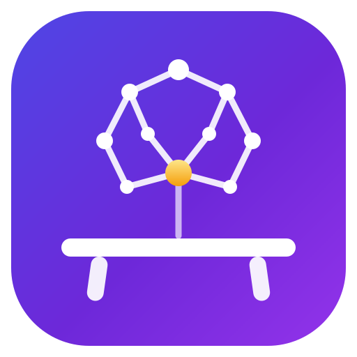

<p align="center">
  
</p>

<h1 align="center">Agent Workbench</h1>

<p align="center">
  <b>A local, dependency-free memory and context layer for AI coding agents<br>(Claude Code, Codex, Gemini CLI).</b>
</p>

<p align="center">
  <a href="https://chud-lori.github.io/agent-workbench/">Website</a> ·
  <a href="AGENTS.md">Agent guide</a> ·
  <a href="ARCHITECTURE.md">Architecture</a>
</p>

<p align="center">
  
  
  
</p>

Agent Workbench gives every agent session on your machine three things they normally lack:

- 🧠 **A persistent brain** — durable notes (decisions, facts, gotchas) stored in SQLite FTS with porter stemming, shared across *all* your AI tools and sessions. What Claude learns today, Codex recalls tomorrow.
- 🔎 **A local code index** — full-text search (bm25) across all your repos in one call, with incremental refresh. No embeddings, no API calls — deterministic lexical retrieval; your agent does the semantic reasoning on top.
- 🩺 **Setup diagnostics** — scans for leaked secrets, broken MCP configs, over-broad permission allowlists, and stale agent docs across your machine.

It is a single stdio MCP server + CLI written in stdlib-only Python (≥3.10, the sole requirement). It makes **no LLM or network calls** — your agent harness provides the reasoning; the workbench provides deterministic retrieval and durable memory. See [ARCHITECTURE.md](ARCHITECTURE.md) for the full design.

## Quickstart

```bash
git clone https://github.com/chud-lori/agent-workbench.git
cd agent-workbench
./setup.sh
```

`setup.sh` detects your harnesses (Claude Code / Codex / Gemini CLI), registers the MCP server, installs the standing instructions (marker-fenced, so re-runs refresh in place), wires the four Claude Code hooks, links the skills and agent types, raises Claude Code's transcript retention off its 30-day default, and builds the code index. Idempotent — re-run it anytime. `./uninstall.sh` reverses everything but keeps `.state/` (your brain).

Manual per-harness steps (if you'd rather not run the script) are in [AGENTS.md → Harness setup](AGENTS.md).

## Configuration

Everything is driven by environment variables with sensible defaults — nothing is hardcoded to any particular machine layout:

| Env var | Default | Purpose |
|---|---|---|
| `AGENT_WORKBENCH_REPO_ROOT` | `~/repo` | Where your work repos live |
| `AGENT_WORKBENCH_INDEX_ROOTS` | repo root | Roots to index (colon/comma-separated) |
| `AGENT_WORKBENCH_PROJECTS_ROOT` | `~/Projects` | Secondary root scanned by diagnostics |
| `AGENT_WORKBENCH_STATE_DIR` | `<repo>/.state` | SQLite state location (index + brain) |
| `AGENT_WORKBENCH_WORK_MCP_ROOT` | `~/Projects/work-mcp` | Optional connector sidecar (see below) |
| `AGENT_WORKBENCH_CODEX_HOME` / `_CLAUDE_HOME` | `~/.codex` / `~/.claude` | Harness config locations for diagnostics |

## MCP tools

**Brain (persistent cross-tool memory):**

- `brain_remember` — store a durable note (`decision` / `fact` / `gotcha` / `preference` / `todo` / `note`) with project + tags; convention: every note carries a source reference (ticket key, Slack thread, doc, or SHA-pinned permalink)
- `brain_recall` — FTS search with porter stemming; recent notes when no query; resolved notes hidden by default; `since`/`until` bound by when a note was stored (`'yesterday'`, `'2026-07-15'`, `'7d'`)
- `brain_resolve` / `brain_forget` — mark done (kept, hidden) / delete
- `brain_export` — dump all notes to markdown (your backup)

**Code index:**

- `code_search` — bm25 keyword search across every indexed repo at once
- `rebuild_code_index` / `refresh_code_index` / `index_status` — full build / incremental refresh / freshness report
- `codebase_overview` — languages, package files, docs per repo
- `search_knowledge` — live search over agent docs (CLAUDE.md, AGENTS.md, SKILL.md, READMEs)
- `find_service_context` — locate the repo + commands for a service name

**Activity:**

- `recent_activity` — commits you made in a time window across every local repo; scans all branches, so unpushed work `gh` cannot see still shows up. The git half of "what did I do yesterday?" — the `/standup` skill merges it with Slack, calendar, and PRs, because the brain stores durable facts, not an activity log.

**Orchestrator:**

- `brief_task` — the task-start context pack: one call merging code hits, doc hits, matching brain notes, likely repos, and runnable commands

**Diagnostics:**

- `doctor_report` — secrets on disk, broken MCP configs, broad permissions, stale docs
- `mcp_health` / `work_sources_status` — MCP config checks / connector sidecar health

## Skills (Claude Code)

Five skills under `harness/skills/` share one pattern: gather from every work source in parallel, verify threads before presenting, cite a surface for every line. setup.sh symlinks them into `~/.claude/skills/`.

- `/standup` — "what did I do yesterday?" from git + PRs + Slack + calendar + brain, as paste-ready Done / Today / Blockers
- `/brain-harvest` — weekly backfill: scan merged PRs, resolved tickets, and Slack for durable knowledge the hooks missed; approval-gated
- `/postmortem` — incident reconstruction: evidence timeline, blameless five-whys, action items with owners; proposes one root-cause gotcha for the brain
- `/why` — code archaeology: blame → commit → PR → ticket → Slack → brain, answering "why does this code exist" with a cited chain
- `/meeting-prep` — one-page brief for the next calendar event: what changed since last time, what you owe / are owed, likely topics

## Agent types (Claude Code)

Subagents get no hooks and none of the parent's context, so brain recall has to
live in their own system prompt. `harness/agents/` ships three types that do:

- `scout` — read-only investigator; recalls notes before searching the filesystem, cites `path:line` and `brain#id`
- `implementer` — implements against recorded decisions/gotchas/preferences, matches surrounding style, verifies with the project's own checks
- `adversary` — loads known failure modes first, then reviews a diff for findings with a concrete failure scenario

setup.sh symlinks them into `~/.claude/agents/`.

## CLI

Every tool has a CLI equivalent for shells, cron jobs, and hooks:

```bash
python3 run_cli.py brief "TICKET-1234"
python3 run_cli.py remember "orders API paginates at 50, per TICKET-1234" --kind fact --project my-api
python3 run_cli.py recall "pagination"
python3 run_cli.py resolve 7          # mark a todo done (kept, hidden from default recall)
python3 run_cli.py export --out brain-backup.md
python3 run_cli.py index && python3 run_cli.py index-status
python3 run_cli.py code-search "rate limiter"
python3 run_cli.py doctor --all
python3 run_cli.py mcp-server         # what the MCP registration runs
```

## Optional: connector sidecar

[work-mcp](https://github.com/chud-lori/work-mcp) is a companion project holding Slack / Google Workspace connector MCPs. Agent Workbench doesn't need it — `work_sources_status` simply reports whether it's present and healthy. The separation is deliberate: connector credentials never live in (or flow through) this project.

## Design notes

- **Lexical, not RAG.** Retrieval is SQLite FTS5 + bm25 — exact, explainable, zero-dependency. Query expansion and synthesis are the LLM's job; brain notes carry source breadcrumbs the agent can follow into Jira/Slack/GitHub via their own MCPs.
- **Worktree-aware.** Repos are identified by their shared git dir, so a linked worktree is folded into its main checkout: commits are counted once, the index keeps one checkout per repository, and `repo_state` tells an agent when it is standing in a worktree.
- **State is local and disposable.** Everything lives in `.state/` (gitignored): `index.sqlite` is rebuildable anytime; `brain.sqlite` is the only thing worth backing up (`brain_export`).
- **Instruction-based vs hook-enforced.** Standing instructions make agents *likely* to use the brain; the SessionStart hook makes recall *guaranteed*. Use both.

## License

Currently unlicensed (all rights reserved). Open an issue if you want to use it and this matters to you.
